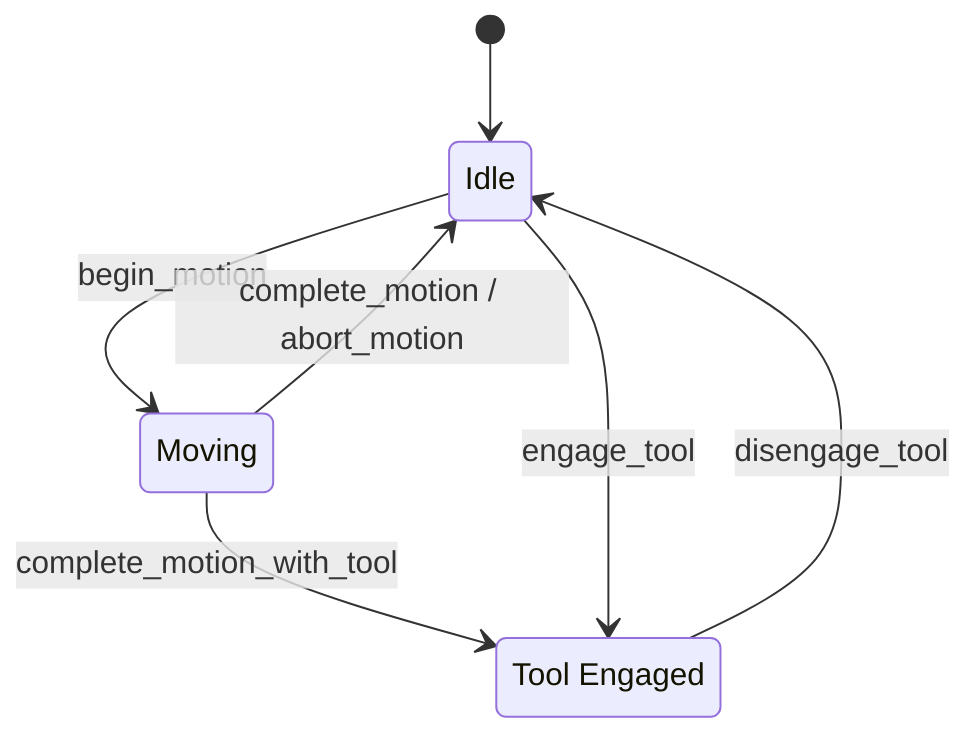
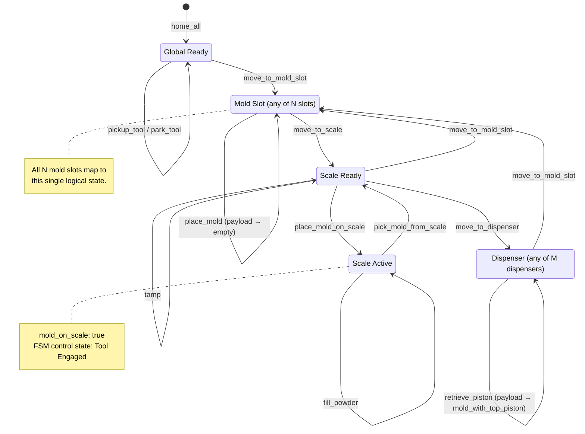

# MotionPlatformStateMachine API Reference

The `MotionPlatformStateMachine` provides validated movement control for the Jubilee powder dispensing system. It ensures all operations are safe by tracking system state and enforcing constraints.

## Overview

The state machine:

- Tracks current position, tool, and payload state
- Validates all requested movements
- Enforces safety constraints
- Provides detailed error messages when operations are invalid

!!! warning "Advanced Usage"
    Most users should interact with `JubileeManager` instead of using the state machine directly. Only use the state machine when you need operations not provided by `JubileeManager`.

## State Machine Diagram

The state machine operates on two layers: a **motion control FSM** and an **operational workflow** defined by named positions and payload context.

### Motion Control FSM

The inner FSM (powered by `python-statemachine`) manages three exclusive control states. Every validated method enters and exits `Moving` transiently; the `Tool Engaged` state is held while the mold rests on the scale.



### Operational Workflow

The following diagram shows the logical position states and the actions that connect them. **All N mold slots resolve to the same `Mold Slot` state, and all M dispensers resolve to the same `Dispenser` state** - the state machine's validation logic is identical regardless of which specific slot or dispenser is targeted.

Payload state transitions are shown on the self-loop actions that change what the manipulator is carrying.



## Class Reference

::: src.MotionPlatformStateMachine.MotionPlatformStateMachine
    options:
      members: true
      show_root_heading: true
      show_source: false
      filters:
        - "!^_"  # Hide private methods

## State Tracking

### Current State

The state machine maintains:

```python
{
    "position": "global_ready",        # Current named position
    "active_tool_id": 0,               # Active tool (or None)
    "payload_state": "empty",          # What manipulator holds
}
```

### Payload States

| State | Description |
|-------|-------------|
| `empty` | Manipulator holds nothing |
| `mold` | Manipulator holds a mold without piston |
| `mold_with_piston` | Manipulator holds a mold containing a piston |

### Position Names

Named positions are defined in `motion_platform_positions.json`:

- `global_ready`: Safe position away from all labware
- `scale_ready`: Position to access the scale
- `mold_slot_*`: Positions for specific wells (e.g., `mold_ready_0`, `mold_ready_1`)
- `dispenser_*_ready`: Positions for piston dispensers

## Validation Results

All validated methods return a `ValidationResult`:

```python
@dataclass
class ValidationResult:
    valid: bool       # Whether operation is allowed
    reason: str = ""  # Explanation if not valid
```

### Example Usage

```python
result = state_machine.validated_move_to_scale()

if result.valid:
    print("Movement successful")
else:
    print(f"Movement failed: {result.reason}")
```

## Common Operations

### Homing

```python
# Home all axes (X, Y, Z, U)
result = state_machine.validated_home_all()
if not result.valid:
    print(f"Homing failed: {result.reason}")

# Home manipulator axis (V)
result = state_machine.validated_home_manipulator(manipulator_axis='V')
if not result.valid:
    print(f"Manipulator homing failed: {result.reason}")
```

**Requirements**:
- No tool picked up (for `validated_home_all`)
- Payload must be empty
- Currently at a named position

### Tool Management

```python
# Pick up a tool
from src.Manipulator import Manipulator

manipulator = Manipulator(
    index=0,
    name="manipulator",
    state_machine=state_machine
)

result = state_machine.validated_pickup_tool(manipulator)
if not result.valid:
    print(f"Tool pickup failed: {result.reason}")

# Park the current tool
result = state_machine.validated_park_tool()
if not result.valid:
    print(f"Tool parking failed: {result.reason}")
```

**Requirements**:
- Must be at `global_ready` position
- Payload must be `empty`
- No tool already picked up (for pickup)
- Manipulator tool must be active (for parking)
- Z-height must be at `mold_transfer_safe`

### Position Movements

```python
# Move to scale
result = state_machine.validated_move_to_scale()

# Move to mold slot
result = state_machine.validated_move_to_mold_slot(well_id="0")

# Move to dispenser
from src.PistonDispenser import PistonDispenser

dispenser = PistonDispenser(index=0, state_machine=state_machine)
result = state_machine.validated_move_to_dispenser(
    piston_dispenser=dispenser
)
```

**Requirements vary by destination**:
- Correct tool must be active
- Payload state must be allowed at destination
- Valid transition must exist from current position

### Specialized Operations

```python
# Fill powder to target weight
result = state_machine.validated_fill_powder(target_weight=50.0)

# Retrieve piston from dispenser
result = state_machine.validated_retrieve_piston(
    piston_dispenser=dispenser,
    manipulator_config=manipulator._get_config_dict()
)
```

## Creating from Configuration

### From File

```python
from pathlib import Path
from science_jubilee.Machine import Machine
from src.Scale import Scale
from src.MotionPlatformStateMachine import MotionPlatformStateMachine
from jubilee_api_config.constants import FeedRate

# Connect to hardware
machine = Machine(address="192.168.1.100")
machine.connect()

scale = Scale(port="/dev/ttyUSB0")
scale.connect()

# Create state machine from config
config_path = Path("jubilee_api_config/motion_platform_positions.json")
state_machine = MotionPlatformStateMachine.from_config_file(
    config_file=config_path,
    machine=machine,
    scale=scale,
    feedrate=FeedRate.MEDIUM
)

# Initialize components
state_machine.initialize_deck()
state_machine.initialize_dispensers(
    num_piston_dispensers=2,
    num_pistons_per_dispenser=10
)
```

## State Updates

### Manual State Updates

In some cases, you may need to manually update the state:

```python
# Update multiple state fields
state_machine.update_context(
    active_tool_id=0,
    payload_state="mold"
)

# Update position
state_machine.context.position = "scale_ready"
```

!!! danger "Manual Updates"
    Manual state updates bypass validation. Only use when you're certain the physical state matches what you're setting.

## Validation Logic

### Position Validation

The state machine validates movements based on:

1. **Current position**: Must be at a valid starting position
2. **Target position**: Must be defined in configuration
3. **Transition exists**: Direct path must be allowed
4. **Tool requirement**: Correct tool must be active
5. **Payload constraint**: Payload must be allowed at target

### Example Validation Failure

```python
# Trying to move to scale with wrong payload
state_machine.context.payload_state = "invalid_state"
result = state_machine.validated_move_to_scale()

# Result:
# valid = False
# reason = "Payload state 'invalid_state' not allowed at position 'scale_ready'"
```

## Configuration Structure

The state machine reads from `motion_platform_positions.json`:

```json
{
  "positions": {
    "position_name": {
      "coordinates": {"x": 100, "y": 100, "z": 50, "safe_z": 150},
      "description": "Position description",
      "requires_tool": "manipulator",
      "allowed_payloads": ["empty", "mold"]
    }
  },
  "transitions": {
    "from_position": {
      "to": ["target_position1", "target_position2"]
    }
  }
}
```

## Advanced Usage

### Custom Movement Sequences

For complex operations, chain validated movements:

```python
def custom_operation(state_machine, well_id, target_weight):
    """Example custom operation using state machine."""
    
    # Move to mold slot
    result = state_machine.validated_move_to_mold_slot(well_id)
    if not result.valid:
        return False, f"Move to slot failed: {result.reason}"
    
    # Update payload (after picking mold)
    state_machine.update_context(payload_state="mold")
    
    # Move to scale
    result = state_machine.validated_move_to_scale()
    if not result.valid:
        return False, f"Move to scale failed: {result.reason}"
    
    # Fill powder
    result = state_machine.validated_fill_powder(target_weight)
    if not result.valid:
        return False, f"Fill failed: {result.reason}"
    
    return True, "Success"
```

### Accessing Internal State

```python
# Get current state
position = state_machine.context.position
tool = state_machine.context.active_tool_id
payload = state_machine.context.payload_state

print(f"State: pos={position}, tool={tool}, payload={payload}")

# Access components
machine = state_machine.machine
scale = state_machine.context.scale
deck = state_machine.context.deck
dispensers = state_machine.context.piston_dispensers
```

## Error Handling

### Common Validation Errors

| Error Reason | Cause | Solution |
|--------------|-------|----------|
| "Position not found" | Target position not in config | Add position to configuration |
| "No transition defined" | Movement not allowed | Add transition or use intermediate position |
| "Wrong tool active" | Tool requirement not met | Pick up required tool first |
| "Payload not allowed" | Payload state incompatible | Change payload or destination |
| "Tool already picked up" | Tool state conflict | Park current tool first |

### Debugging Validation Failures

```python
result = state_machine.validated_move_to_scale()

if not result.valid:
    print(f"Validation failed: {result.reason}")
    print(f"Current state:")
    print(f"  Position: {state_machine.context.position}")
    print(f"  Tool: {state_machine.context.active_tool_id}")
    print(f"  Payload: {state_machine.context.payload_state}")
```

## Thread Safety

!!! warning "Not Thread-Safe"
    The state machine is **not thread-safe**. Do not call methods from multiple threads simultaneously. Use appropriate locking if multi-threaded access is required.

## See Also

- [JubileeManager](jubilee-manager.md) - High-level interface (recommended)
- [MovementExecutor](../api/config-loader.md) - Low-level movement execution
- [Architecture Guide](../concepts/architecture.md) - System design overview
- [Configuration Guide](../how-to/configuration.md) - Setting up positions and transitions

