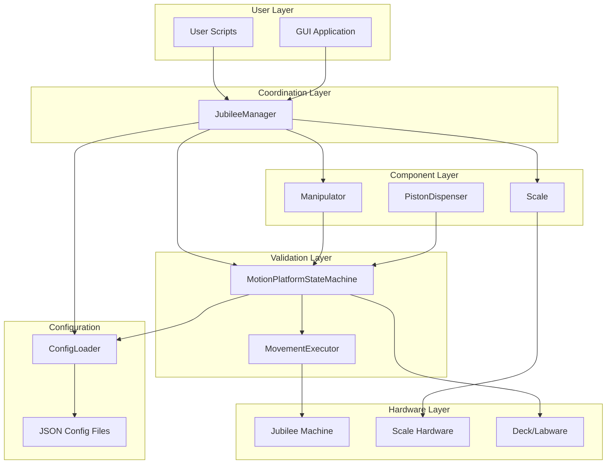
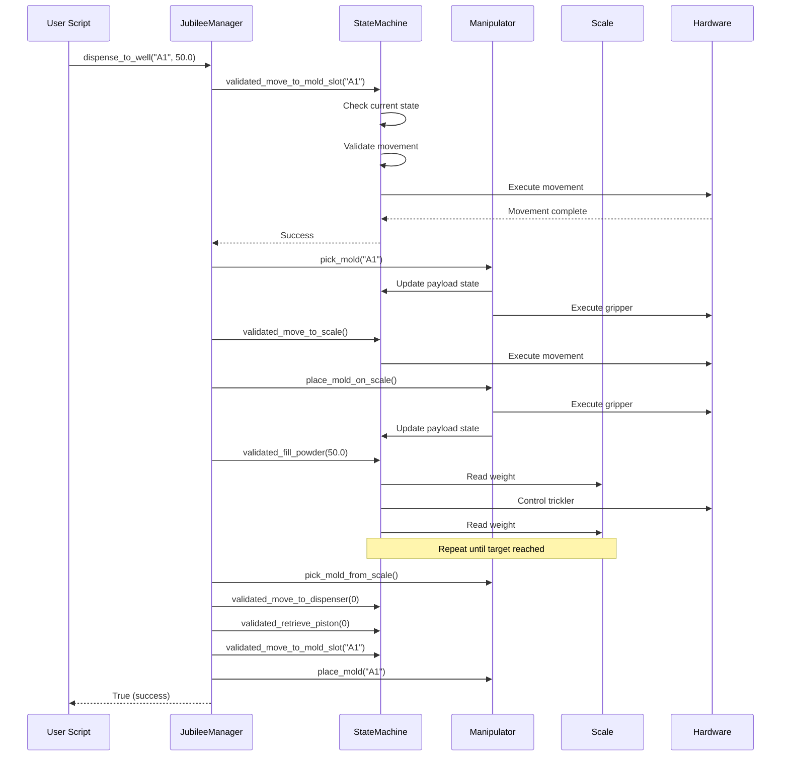

# System Architecture

This document explains the architecture of the Jubilee Powder system at a conceptual level.

## Overview

The Jubilee Powder system uses a layered architecture where each layer provides a different level of abstraction and control.

## Architecture Diagram

## Layer Details

### 1. User Layer

**Purpose**: Entry point for automation tasks

**Components**:

- **User Scripts**: Python scripts written by users to automate specific tasks
- **GUI Application**: Browser-based interface for manual control and monitoring

**Responsibilities**:

- Define high-level workflows
- Handle application-specific logic
- Interpret results and make decisions

### 2. Coordination Layer

**Purpose**: Coordinate complex multi-component operations

**Components**:

- **JubileeManager**: Central orchestrator for all operations

**Responsibilities**:

- Connect to and manage all hardware components
- Provide high-level API for common operations
- Coordinate multi-step operations (e.g., dispense_to_well)
- Handle errors and provide meaningful feedback

**Key Design Decisions**:

- Single point of access for most operations
- Owns the state machine (cannot be bypassed)
- Provides both convenience methods and component access

### 3. Validation Layer

**Purpose**: Ensure all operations are safe and valid

**Components**:

- **MotionPlatformStateMachine**: Validates and executes movements
- **MovementExecutor**: Executes validated movements on hardware

**Responsibilities**:

- Track current system state (position, tool, payload)
- Validate requested movements against current state
- Enforce movement constraints and safe zones
- Provide detailed error messages for invalid requests
- Execute validated movements

**State Machine States**:

The state machine tracks:

- **Position**: Current named position (e.g., "global_ready", "scale_ready")
- **Active Tool**: Which tool is currently picked up (or None)
- **Payload**: What the manipulator is holding (empty, mold, mold_with_piston)

**Validation Rules**:

- Tool must be picked up to move to certain positions
- Payload state affects which movements are allowed
- Some operations require specific starting positions

### 4. Component Layer

**Purpose**: Represent individual hardware components

**Components**:

- **Manipulator**: Gripper tool with vertical axis
- **PistonDispenser**: Container for pistons with tracking
- **Scale**: Weight measurement device

**Responsibilities**:

- Encapsulate component-specific logic
- Provide component-specific operations
- Maintain component state
- Interact with validation layer for movements

### 5. Hardware Layer

**Purpose**: Physical hardware interface

**Components**:

- **Jubilee Machine**: CNC motion platform (via science-jubilee library)
- **Scale Hardware**: Precision balance (via serial connection)
- **Deck/Labware**: Physical deck layout and labware definitions

**Responsibilities**:

- Execute physical movements
- Report sensor readings
- Handle low-level communication protocols

### 6. Configuration

**Purpose**: Centralize system configuration

**Components**:

- **ConfigLoader**: Loads and provides access to configuration
- **JSON Config Files**: Define positions, deck layouts, system parameters

**Configuration Files**:

- `motion_platform_positions.json`: State machine positions and transitions
- `system_config.json`: System-level settings
- `mold_labware.json`: Deck layout and labware definitions
- `weight_well_deck.json`: Well-specific configurations

## Data Flow

### Example: Dispense to Well Operation

Let's trace how a `dispense_to_well` operation flows through the system:

## Key Design Principles

### Safety Through Validation

All movements must pass through the state machine validator. This prevents:

- Moving to unsafe positions
- Collisions between tools and labware
- Invalid state transitions
- Operating on wrong component

### Progressive Disclosure

The architecture supports multiple levels of complexity:

- **Simple**: Use JubileeManager methods (most users)
- **Advanced**: Access state machine directly (power users)
- **Expert**: Access components and machine directly (developers)

### State Tracking

The system maintains comprehensive state:

- Physical position of motion platform
- Active tool and payload
- Component states (dispenser piston counts, etc.)
- Configuration data

### Fail-Safe Defaults

When operations fail:

- Clear error messages explain what went wrong
- System state remains consistent
- No silent failures
- Failed operations return False/ValidationResult

### Configuration-Driven

Physical parameters are in configuration files, not code:

- Easy to adapt to different setups
- No recompilation needed
- Version control for configurations
- Validation of configuration data

## Component Interactions

### JubileeManager ↔ StateMachine

- JubileeManager owns the StateMachine
- All movements go through StateMachine validation
- JubileeManager coordinates multi-step operations
- StateMachine enforces single-step safety

### Manipulator ↔ StateMachine

- Manipulator updates payload state via StateMachine
- State machine validates movements based on payload
- Manipulator uses StateMachine for movements

### Configuration ↔ All Components

- All components read their configuration via ConfigLoader
- Positions, speeds, and parameters come from JSON
- Configuration is loaded once at startup

## Extending the System

### Adding New Operations

To add a new high-level operation:

1. Add method to `JubileeManager`
2. Break down into state machine operations
3. Call `validated_*` methods on state machine
4. Handle errors and return success/failure

### Adding New Hardware

To add a new hardware component:

1. Create new component class (like `PistonDispenser`)
2. Add component to state machine context
3. Add validation logic if needed
4. Add configuration entries
5. Add convenience methods to JubileeManager

### Adding New Positions

To add a new named position:

1. Add entry to `motion_platform_positions.json`
2. Define allowed transitions
3. Define constraints (tool required, payload restrictions)
4. Add convenience method to JubileeManager if needed

## Performance Considerations

### Movement Optimization

- State machine can batch movements when safe
- Configuration sets appropriate feed rates
- Direct paths when validated as safe

### Error Handling

- Validation happens before movement (fail fast)
- Clear error messages reduce debugging time
- State preserved on failure for recovery

## Security Considerations

### Access Control

- State machine prevents bypass of validation
- JubileeManager owns state machine exclusively
- Configuration files control physical limits

### Safety Zones

- Configuration defines safe operating areas
- State machine enforces these boundaries
- Emergency stop accessible via hardware

## Next Steps

- Review the [Glossary](glossary.md) for terminology
- Explore [JubileeManager API](../api/jubilee-manager.md)
- Understand [State Machine Details](../api/motion-platform.md)

