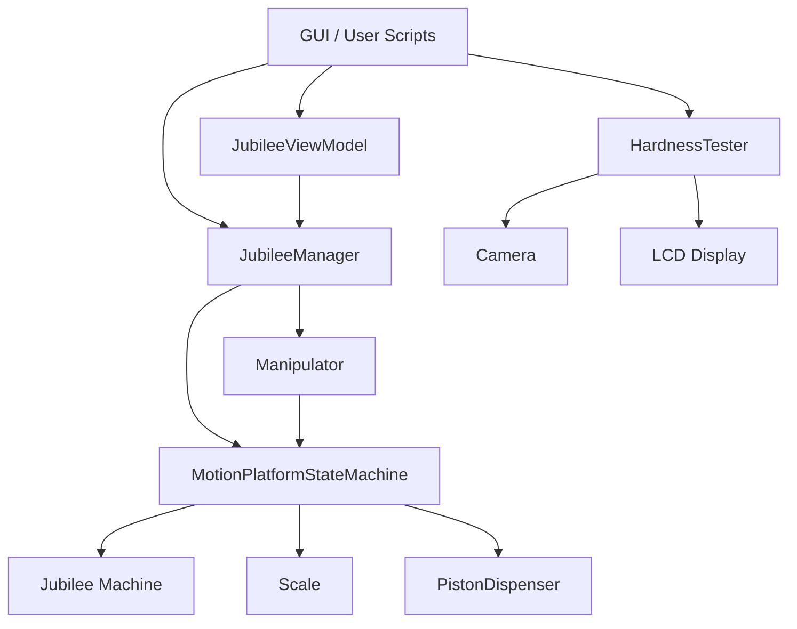

# Jubilee Powder Documentation

Welcome to the Jubilee Powder documentation! This system provides automated powder dispensing and handling using the Jubilee Motion Platform for precision laboratory tasks.

## What is Jubilee Powder?

Jubilee Powder is a Python-based system that enables programmatic control of the [Jubilee Motion Platform](https://github.com/machineagency/jubilee) for automated powder dispensing operations. It provides high-level abstractions for complex operations like precision powder dispensing, weighing, and material handling.

## Quick Navigation

### For Users

If you're looking to **use** the Jubilee system for your laboratory work:

- **Start here:** [Quick Start Guide](getting-started/quickstart.md)
- **Learn concepts:** [Architecture Overview](concepts/architecture.md)
- **Follow recipes:** [How-To Guides](how-to/run-new-data.md)
- **Use the GUI:** [GUI User Guide](how-to/using-gui.md)
- **Use the Web UI:** [Web Interface Guide](how-to/web-ui.md)
- **Read LCD displays:** [LCD Display Reading Guide](how-to/reading-lcd-displays.md)

### For Developers

If you're looking to **extend** or **modify** the system:

- **Core API:** [JubileeManager Reference](api/jubilee-manager.md)
- **State Machine:** [MotionPlatformStateMachine Reference](api/motion-platform.md)
- **GUI Framework:** [JubileeViewModel Reference](api/gui/jubilee-view-model.md)
- **LCD Reader:** [HardnessTester Reference](api/hardness-tester.md)
- **All APIs:** [Complete API Reference](api/jubilee-manager.md)

## What's Important?

### GUI Interface (Recommended for Most Users)

The [GUI Application](how-to/using-gui.md) provides a touchscreen-friendly interface:

- Visual well selection and configuration
- Real-time progress monitoring
- Hardware configuration without code
- Built-in safety checklist
- Live weight display

**Best choice for interactive operation and monitoring.**

### Python API: JubileeManager

The [`JubileeManager`](api/jubilee-manager.md) class is your main programming entry point:

- Safe, validated movements through an internal state machine
- High-level operations (dispense, weigh, move)
- Connection management for all hardware components
- Error handling and safety checks

**Use this for scripted automation and custom workflows.**

### GUI Framework: JubileeViewModel

The [`JubileeViewModel`](api/gui/jubilee-view-model.md) coordinates GUI and hardware:

- MVVM-inspired architecture
- Callback system for real-time updates
- Job execution management
- Thread-safe operations

**Use this if customizing or extending the GUI.**

### Advanced Control: MotionPlatformStateMachine

The [`MotionPlatformStateMachine`](api/motion-platform.md) provides granular control when needed:

> **Advanced Use Only:** Direct state machine access for complex sequences, lower-level movement primitives, and custom validation logic.

**Only use this if JubileeManager doesn't provide what you need.**

### LCD Display Reading: HardnessTester

The [`HardnessTester`](api/hardness-tester.md) reads 7-segment LCD displays using segment detection:

- Segment-based recognition (no OCR required)
- Works with low-contrast displays
- Calibration system for accurate reading
- Fast and lightweight (no ML dependencies)

**Use this for reading LCD displays on scales, meters, or other equipment.**

## Simple Examples

### Powder Dispensing

Here's a minimal example of using JubileeManager to perform a powder dispense operation:

```python
from src.JubileeManager import JubileeManager

# Create and connect to the powder dispensing system
manager = JubileeManager(
    num_piston_dispensers=2,
    num_pistons_per_dispenser=10
)

# Connect to hardware
if manager.connect(
    machine_address="192.168.1.100",
    scale_port="/dev/ttyUSB0"
):
    print("Connected successfully!")
    
    # Perform a dispense operation
    success = manager.dispense_to_well(
        well_id="0",
        target_weight=50.0  # grams
    )
    
    if success:
        print("Dispense complete!")
    
    # Clean up
    manager.disconnect()
```

### LCD Display Reading

Here's a minimal example of reading a 7-segment LCD display:

```python
from src.HardnessTester import HardnessTester

# Initialize LCD reader for 4-digit display
reader = HardnessTester(num_digits=4)

# Load calibration (one-time setup required)
reader.load_calibration('lcd_calibration.json')

# Read the display
result = reader.read_display()

if result and '?' not in result:
    print(f"LCD shows: {result}")
    # Convert to number if needed
    value = int(result)
else:
    print("Reading failed or unclear")
```

## Key Features

- **Touchscreen GUI**: Modern interface for interactive powder dispensing
- **Python API**: Full programmatic control for automation
- **Hardware Integration**: Control Jubilee motion platform, scales, and dispensers
- **LCD Display Reading**: Segment-based recognition for 7-segment displays
- **Safety Validation**: All movements validated through state machine
- **Flexible Configuration**: JSON-based configuration system
- **MVVM Architecture**: Clean separation between GUI, coordination, and hardware
- **Type Safety**: Full type hints throughout the codebase

## System Architecture


```mermaid
graph TD
    A[GUI / User Scripts] --> B[JubileeViewModel]
    A --> C[JubileeManager]
    A --> I[HardnessTester]
    B --> C
    C --> D[MotionPlatformStateMachine]
    D --> E[Jubilee Machine]
    D --> F[Scale]
    D --> G[PistonDispenser]
    C --> H[Manipulator]
    H --> D
    I --> J[Camera]
    I --> K[LCD Display]
```

The system uses a layered architecture where:

1. **GUI / User Scripts** interact with `JubileeViewModel`, `JubileeManager`, or `HardnessTester`
2. **JubileeViewModel** coordinates GUI operations (optional layer for GUI)
3. **JubileeManager** coordinates high-level powder dispensing operations
4. **HardnessTester** reads LCD displays using segment detection
5. **MotionPlatformStateMachine** validates and executes movements
6. **Hardware Components** (Jubilee, Scale, Dispensers, Camera) perform physical actions

## Next Steps

- **New to the system?** Start with the [Quick Start Guide](getting-started/quickstart.md)
- **Ready to use it?** Check out the [How-To Guides](how-to/run-new-data.md)
- **Need API details?** Browse the [API Reference](api/jubilee-manager.md)
- **Want to understand the design?** Read the [Architecture Guide](concepts/architecture.md)

## Getting Help

If you encounter issues or have questions:

1. Check the [Glossary](concepts/glossary.md) for terminology
2. Review the [How-To Guides](how-to/run-new-data.md) for common tasks
3. Consult the [API Reference](api/jubilee-manager.md) for detailed function documentation
