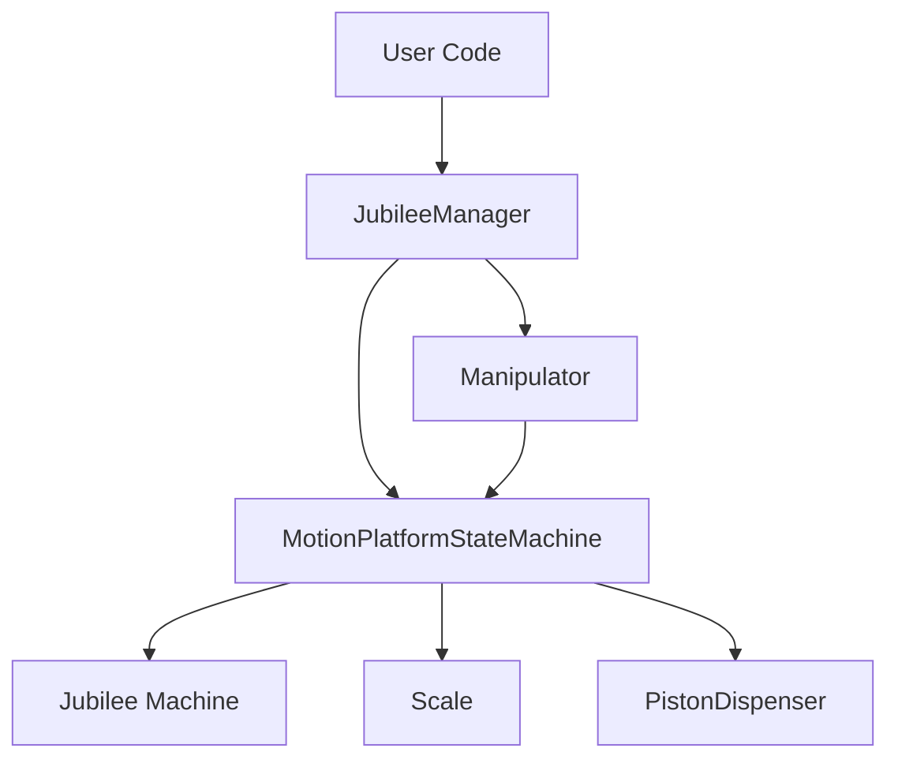

# Jubilee Powder Documentation

Welcome to the Jubilee Powder documentation! This system provides automated powder dispensing and handling using the Jubilee Motion Platform for precision laboratory tasks.

## What is Jubilee Powder?

Jubilee Powder is a Python-based system that enables programmatic control of the [Jubilee Motion Platform](https://github.com/machineagency/jubilee) for automated powder dispensing operations. It provides high-level abstractions for complex operations like precision powder dispensing, weighing, and material handling.

## Quick Navigation

### For Users

If you're looking to **use** the Jubilee system for your laboratory work:

- **Start here:** [Quick Start Guide](getting-started/quickstart.md)
- **Learn concepts:** [Architecture Overview](concepts/architecture.md)
- **Follow recipes:** [How-To Guides](how-to/run-new-data.md)
- **Use the UI:** [Web Interface Guide](how-to/web-ui.md)

### For Developers

If you're looking to **extend** or **modify** the system:

- **Core API:** [JubileeManager Reference](api/jubilee-manager.md)
- **State Machine:** [MotionPlatformStateMachine Reference](api/motion-platform.md)
- **All APIs:** [Complete API Reference](api/jubilee-manager.md)

## What's Important?

### Primary Interface: JubileeManager

The [`JubileeManager`](api/jubilee-manager.md) class is your main entry point. It provides:

- ✅ Safe, validated movements through an internal state machine
- ✅ High-level operations (dispense, weigh, move)
- ✅ Connection management for all hardware components
- ✅ Error handling and safety checks

**You should interact with `JubileeManager` for almost everything.**

### Advanced Control: MotionPlatformStateMachine

The [`MotionPlatformStateMachine`](api/motion-platform.md) provides granular control when needed:

- ⚠️ Direct state machine access for complex sequences
- ⚠️ Lower-level movement primitives
- ⚠️ Custom validation logic

**Only use this if JubileeManager doesn't provide what you need.**

## Simple Example

Here's a minimal example of using JubileeManager to perform a powder dispense operation:

```python
from src.JubileeManager import JubileeManager

# Create and connect to the powder dispensing system
manager = JubileeManager(
    num_piston_dispensers=2,
    num_pistons_per_dispenser=10
)

# Connect to hardware
if manager.connect(
    machine_address="192.168.1.100",
    scale_port="/dev/ttyUSB0"
):
    print("Connected successfully!")
    
    # Perform a dispense operation
    success = manager.dispense_to_well(
        well_id="A1",
        target_weight=50.0  # grams
    )
    
    if success:
        print("Dispense complete!")
    
    # Clean up
    manager.disconnect()
```

## Key Features

- **Hardware Integration**: Control Jubilee motion platform, scales, and dispensers
- **Safety Validation**: All movements validated through state machine
- **Flexible Configuration**: JSON-based configuration system
- **Web Interface**: Browser-based control and monitoring
- **Type Safety**: Full type hints throughout the codebase

## System Architecture



The system uses a layered architecture where:

1. **User Code** interacts with `JubileeManager`
2. **JubileeManager** coordinates high-level operations
3. **MotionPlatformStateMachine** validates and executes movements
4. **Hardware Components** (Jubilee, Scale, Dispensers) perform physical actions

## Next Steps

- **New to the system?** Start with the [Quick Start Guide](getting-started/quickstart.md)
- **Ready to use it?** Check out the [How-To Guides](how-to/run-new-data.md)
- **Need API details?** Browse the [API Reference](api/jubilee-manager.md)
- **Want to understand the design?** Read the [Architecture Guide](concepts/architecture.md)

## Getting Help

If you encounter issues or have questions:

1. Check the [Glossary](concepts/glossary.md) for terminology
2. Review the [How-To Guides](how-to/run-new-data.md) for common tasks
3. Consult the [API Reference](api/jubilee-manager.md) for detailed function documentation
